# DATABASE SPEC — สถาปัตยกรรมฐานข้อมูลแบบประหยัด Storage สูงสุด

> เอกสารนี้คือ spec ของ schema ที่ออกแบบใหม่เพื่อลด **storage / CPU / RAM** ของทั้ง database และ backend
> ให้ต่ำที่สุดโดยไม่เสียเงินเพิ่ม พร้อม ER diagram และคำอธิบายทุก field ว่าคืออะไร เก็บอย่างไร อ่านอย่างไร
>
> แผนแบ่งเป็น 2 เฟส:
> - **Phase 1 (ทำแล้ว — migration `V19`)**: ตัดข้อมูลซ้ำซ้อน/คอลัมน์ที่ไม่มีใครอ่านออก โดย **ไม่เปลี่ยน API และไม่เสี่ยงกับข้อมูล** — ลดได้ ~35–55% ทันที
> - **Phase 2 (spec ไว้ ทำนอกฤดูแข่ง)**: เปลี่ยนระบบ key ทั้งหมดเป็น key เล็ก (smallint/composite) และรวมตาราง — ลดรวม ~70–85%

---

## 1. ปัญหาของ schema เดิม (ทำไม storage บวม)

การวัดขนาดจริงของ PostgreSQL ต่อ 1 แถว = ข้อมูลจริง + **tuple header 23 byte + line pointer 4 byte ≈ 28 byte** เสมอ
และทุก index ที่ชี้แถวนั้นกินเพิ่มอีก entry ละ ~16–50 byte ดังนั้น "แถวเล็ก คอลัมน์น้อย index น้อย" คือหัวใจ

ปัญหาที่พบเรียงตามความหนัก:

| # | ปัญหา | หนักแค่ไหน |
|---|--------|-----------|
| 1 | **`pairing_snapshots.payload` (JSONB)** เก็บผลการจับคู่+ผลแข่ง **ซ้ำทั้งชุด** กับที่มีอยู่แล้วใน `matches`+`match_results` — โค้ดอ่านกลับ **ไม่เคยใช้ payload เลย** (rebuild จากตาราง relational ทุกครั้ง) | ~7–8 KB/snapshot, ต่อการ์ด 8 เกม ≈ 20–50 KB **ทิ้งเปล่า 100%** |
| 2 | **`audit_logs.old_value / new_value` เป็น JSONB** ทั้งที่ค่าเป็น string สั้นๆ ("review", "game 3") — JSONB มี overhead ต่อ key/parse และตอนอ่านต้อง Jackson parse ทุกแถว (1,000 แถว/ครั้ง) | แถว audit ใหญ่ขึ้น ~30% + เผา CPU ตอนอ่าน |
| 3 | **UUID เป็น PK/FK ทุกตาราง** — 16 byte ต่อค่า; `matches` 1 แถวแบก UUID ถึง 6 ตัว (96 byte) + ทุก index entry ก็ 16 byte | ตารางใหญ่สุดของระบบจ่ายแพงสุด |
| 4 | **`match_results` แยกตารางจาก `matches`** ทั้งที่เป็น 1:1 — เสีย PK index + UNIQUE index + FK + `match_id` ซ้ำอีก 16 byte ต่อแถว | ~100 byte/ผลแข่ง จ่ายฟรี |
| 5 | **คอลัมน์ที่ไม่มีใครอ่าน**: `match_results.version` (bump ทุกครั้งที่แก้ผล → สร้าง dead tuple/WAL ฟรี), `pairing_snapshots.bundle_key`, `payload_hash`, `standings.id` (มี UNIQUE(card,player) อยู่แล้ว), `players.division` (ก๊อปมาจาก card ทุกแถว) | เนื้อ + index + churn |
| 6 | **INTEGER (4 byte) ในที่ที่ smallint (2 byte) พอ**: คะแนน, เบอร์โต๊ะ, เบอร์เกม | เล็กแต่คูณด้วยจำนวนแถวมากสุด |

> ⚠️ ความเชื่อผิด: การลด `VARCHAR(180)` → `VARCHAR(64)` **ไม่ลด storage เลย** — Postgres เก็บตามความยาวจริงเสมอ (+1–4 byte header) ตัวเลขในวงเล็บเป็นแค่ constraint จึงไม่ใช่เป้าหมายของการ optimize

---

## 2. เทคนิคทั้งหมดที่ใช้ในการออกแบบ

1. **Derive, don't store** — ข้อมูลที่คำนวณกลับได้จากตารางหลัก ห้ามเก็บซ้ำ (ตัด snapshot payload; standings เป็น cache ตารางเดียวที่ยอมเก็บเพราะถูก recompute ตอน publish อยู่แล้วและแถวเล็ก)
2. **Merge 1:1 tables** — `match_results` ยุบเข้า `matches` (Phase 2): ตัด 1 heap + 3 index + 1 FK
3. **Key ให้เล็กที่สุดเท่าที่ scope ต้องการ** — ผู้เล่นอยู่ใน scope ของการ์ดเสมอ → ใช้ `(card_id, code smallint)` แทน UUID; โค้ด `P001` = smallint `1` (encode/decode ที่ query ชั้นเดียว)
4. **UUID เก็บไว้เฉพาะสิ่งที่ต้อง unguessable จากภายนอก** — `tournaments`, `tournament_cards` (อยู่ใน URL สาธารณะ) เท่านั้น
5. **Enum → code สั้น** — `result_type`: `'W'/'D'/'P'` (CHAR 1) แทน `'WIN'/'DRAW'/'PENALTY'`; ชื่อเต็มแปลตอน SELECT ด้วย CASE (อ่านออกเสมอ)
6. **smallint ทุกที่ที่ค่าจริง < 32,767** — score, table_no, game_no, seat, slot (คะแนน Scrabble จริง < 1,000)
7. **จัดลำดับคอลัมน์กันช่องว่าง (alignment padding)** — เรียง 16/8-byte ก่อน แล้ว 4, 2, 1: Postgres pad คอลัมน์ให้ตรง alignment ถ้าเรียงสลับจะเสียได้ถึง 6 byte/แถว (ทำได้ตอนสร้างตารางใหม่ = Phase 2)
8. **Index น้อยที่สุด + partial index** — ทุก index จ่ายทั้ง storage และ CPU ตอน write; ใช้ composite PK แทน surrogate id เพื่อให้ PK ทำหน้าที่ query index ไปด้วย
9. **TEXT แทน JSONB เมื่อไม่ query เข้าไปใน JSON** — audit values ไม่เคยถูก query ด้วย operator ของ JSON เลย
10. **ตัด write ที่ไม่มีคนอ่าน** — `version = version + 1` ของ match_results สร้าง WAL + dead tuple ทุกการแก้ผล ทั้งที่ไม่มีโค้ดอ่าน
11. **HOT update friendly** — เมื่อคอลัมน์ที่ update (คะแนน) ไม่อยู่ใน index ใดๆ Postgres แก้ในหน้า heap เดิมได้โดยไม่แตะ index (ลด bloat + WAL) — การตัด `idx_results_winner` และ version ช่วยตรงนี้
12. **Blob ที่บีบอัดแล้วไม่บีบซ้ำ** — `tournament_archives.content` เป็น .xlsx (zip อยู่แล้ว) → TOAST จะเก็บ external แบบไม่เสีย CPU บีบซ้ำ

---

## 3. ER DIAGRAM (schema เป้าหมาย Phase 2)

```mermaid
erDiagram
    tournaments ||--o{ tournament_cards : "มีหลายรุ่น (card)"
    tournaments ||--o{ tournament_members : "director ที่ดูแล"
    tournaments ||--o{ staff_tournament_access : "staff ที่ได้สิทธิ์"
    staff_accounts ||--o{ staff_authorities : "บทบาท"
    staff_accounts ||--o{ tournament_members : ""
    staff_accounts ||--o{ staff_tournament_access : ""
    tournament_cards ||--o{ games : "เกม 1..N"
    tournament_cards ||--o{ pairing_rules : "กติกาจับคู่ระหว่างเกม"
    tournament_cards ||--o{ players : "ผู้เล่น (code เป็น smallint)"
    tournament_cards ||--o{ competition_tables : "โต๊ะ (เฉพาะช่วงจัดโต๊ะ)"
    tournament_cards ||--o{ pairing_snapshots : "หมุดยืนยันผลต่อบล็อกเกม"
    tournament_cards ||--o{ matches : "คู่แข่ง + ผล (รวมตารางแล้ว)"
    tournament_cards ||--o{ standings : "อันดับ (cache)"
    tournament_cards ||--o{ audit_logs : "บันทึกกิจกรรม"
    tournament_cards ||--o{ final_pairings : "รอบชิง (ถ้ามี)"
    final_pairings ||--o{ final_game_results : "ผลต่อเกมย่อย"
    players ||--o{ matches : "ผู้เล่น 1/2/ผู้ชนะ อ้างด้วย code"
    players ||--o{ standings : ""
    pairing_snapshots ||--o{ matches : "ผูกตอน publish"

    tournaments {
        uuid id PK "unguessable — อยู่ใน URL"
        varchar name
        varchar access_token UK "ลิงก์เข้าชม"
        char(1) status "O=OPEN, C=CLOSED"
        varchar created_by FK
        timestamptz created_at
        bigint version "optimistic lock"
    }

    tournament_cards {
        uuid id PK "unguessable — อยู่ใน URL สาธารณะ"
        uuid tournament_id FK
        varchar name
        varchar division
        smallint number_of_games "2..12"
        smallint current_game
        char(1) status "D/R/U/F/C = DRAFT/READY/RUNNING/FINISHED/CLOSED"
        char(2) runtime_stage "รหัส 2 ตัวอักษร ดูตารางแปลง"
        char(1) final_type "N/C/T = NONE/CHAMPION/CHAMPION_AND_THIRD"
        smallint final_games
        boolean gibson_enabled
        timestamptz created_at
        bigint version
        bigint public_version "เปลี่ยนเมื่อ viewer เห็นต่างจากเดิม"
    }

    games {
        uuid card_id PK,FK "PK = (card_id, game_no)"
        smallint game_no PK
        char(1) status "P/O/C = PENDING/OPEN/COMPLETED"
        integer max_diff "เพดาน diff (default 350)"
    }

    pairing_rules {
        uuid card_id PK,FK "PK = (card_id, from_game)"
        smallint from_game PK
        char(1) rule_type "P/S/K = PAIR_RESULT/SWISS/KING_OF_THE_HILL"
    }

    players {
        uuid card_id PK,FK "PK = (card_id, code)"
        smallint code PK "1 → แสดงผลเป็น P001"
        varchar first_name
        varchar last_name
        varchar school "ใช้เช็คห้ามโรงเรียนเดียวกันเจอกันเกม 1"
    }

    competition_tables {
        uuid card_id PK,FK "PK = (card_id, table_no, seat_no)"
        smallint table_no PK
        smallint seat_no PK "1..4"
        smallint player_code FK
    }

    pairing_snapshots {
        uuid card_id PK,FK "PK = (card_id, snapshot_no)"
        smallint snapshot_no PK "ลำดับที่ publish 1,2,3,..."
        smallint game_from "เกมแรกของบล็อก"
        smallint game_to "เกมสุดท้ายของบล็อก (= game_from ถ้าบล็อกเดียว)"
        timestamptz confirmed_at
        timestamptz voided_at "NULL = ใช้งานอยู่; ไม่ NULL = ถูก un-pair"
        varchar voided_by
    }

    matches {
        uuid card_id PK,FK "PK = (card_id, game_no, table_no)"
        smallint game_no PK
        smallint table_no PK
        smallint player_one FK "code ผู้เล่น; NULL = ยังไม่มีคู่ (pair-result ปลายทาง)"
        smallint player_two FK "NULL = bye"
        smallint snapshot_no FK "NULL = ยังไม่ publish"
        timestamptz pairing_published_at "เวลาที่ viewer เห็น pairing"
        smallint score_one "NULL = ยังไม่กรอกผล"
        smallint score_two
        char(1) result_type "W/D/P = WIN/DRAW/PENALTY; NULL = ยังไม่มีผล"
        smallint winner "code ผู้ชนะ; NULL เมื่อ DRAW/PENALTY"
        integer calculated_diff "min(|s1-s2|, max_diff)"
        varchar submitted_by "username ผู้กรอก"
        timestamptz submitted_at
    }

    standings {
        uuid card_id PK,FK "PK = (card_id, player_code) — cache คำนวณใหม่ทุก publish"
        smallint player_code PK
        smallint wins
        smallint draws
        smallint losses
        smallint win_points "ชนะ=2 เสมอ=1"
        integer diff "ผลรวม diff"
        smallint rank
    }

    audit_logs {
        bigint id PK "GENERATED IDENTITY — 8 byte เรียงตามเวลาในตัว"
        uuid card_id FK
        varchar actor "username"
        varchar action "รหัสกิจกรรม เช่น SUBMIT_RESULT"
        text old_value "ข้อความธรรมดา ไม่ใช่ JSONB"
        text new_value
        timestamptz created_at
    }

    final_pairings {
        uuid card_id PK,FK "PK = (card_id, slot)"
        smallint slot PK "0 = ชิงที่ 1, 1 = ชิงที่ 3"
        smallint player_one FK
        smallint player_two FK
        smallint winner "ตัดสิน series ด้วยมือ"
    }

    final_game_results {
        uuid card_id PK,FK "PK = (card_id, slot, game_index)"
        smallint slot PK
        smallint game_index PK
        smallint score_one
        smallint score_two
    }
```

*(ตารางบัญชี `staff_accounts`, `staff_authorities`, `tournament_members`, `staff_tournament_access`, `tournament_archives` คงเดิม — เล็กมากอยู่แล้ว)*

---

## 4. รายละเอียดทุก field — คืออะไร เก็บยังไง อ่านยังไง

### 4.1 `tournament_cards` — รุ่นการแข่งขัน 1 ใบ

| field | type | ความหมาย | วิธีเก็บ/อ่าน |
|---|---|---|---|
| `id` | UUID | รหัสการ์ด อยู่ใน URL สาธารณะ (`/cards/{id}`) | ต้อง unguessable จึงคง UUID |
| `tournament_id` | UUID FK | การ์ดนี้อยู่ใน tournament ไหน | |
| `name`, `division` | VARCHAR | ชื่อรายการ / รุ่น เช่น "ม.ต้น ชาย" | เก็บตามจริง (varlena) |
| `number_of_games` | SMALLINT | จำนวนเกมทั้งหมด 2–12 | |
| `current_game` | SMALLINT | เกมที่กำลังดำเนิน | |
| `status` | CHAR(1) | สถานะการ์ด | `D`=DRAFT `R`=READY `U`=RUNNING `F`=FINISHED `C`=CLOSED — อ่านชื่อเต็มด้วย `CASE status WHEN 'D' THEN 'DRAFT' ...` |
| `runtime_stage` | CHAR(2) | ขั้นตอนงานปัจจุบัน | `PR`=PLAYER_REGISTRATION `TP`=TABLE_PAIRING `PP`=PAIRING_PREVIEW `RC`=RESULT_COLLECTION `RR`=RESULT_REVIEW `FS`=FINAL_SEEDING `FC`=FINAL_COLLECTION `FP`=FINAL_PUBLISHED |
| `final_type` | CHAR(1) | ประเภทรอบชิง | `N`=ไม่มี `C`=ชิงแชมป์ `T`=ชิงแชมป์+ที่สาม |
| `final_games` | SMALLINT | จำนวนเกมของรอบชิง | |
| `gibson_enabled` | BOOLEAN | เปิด Gibson pairing ไหม | 1 byte |
| `version` | BIGINT | optimistic lock ภายใน staff | bump ทุก mutation |
| `public_version` | BIGINT | เวอร์ชันที่ viewer เห็น | เปลี่ยนเฉพาะเมื่อข้อมูลสาธารณะเปลี่ยน — เป็นกุญแจของ cache/SSE |
| `created_at` | TIMESTAMPTZ | | 8 byte |

### 4.2 `players` — ผู้เล่น (จ่ายถูกลงมากสุดใน Phase 2)

| field | type | ความหมาย | วิธีเก็บ/อ่าน |
|---|---|---|---|
| `card_id` | UUID PK | ผู้เล่น scope อยู่ในการ์ดเสมอ | ครึ่งแรกของ composite PK |
| `code` | SMALLINT PK | เลขผู้เล่น | **เก็บ `1` อ่านเป็น `P001`** ด้วย `'P' \|\| lpad(code::text, 3, '0')`; ทางกลับ: `substring(ext from 2)::smallint` — คือค่าเดียวกับ `external_id` เดิมแต่จาก 16+~8 byte เหลือ 2 byte และแทนที่ UUID ทุกจุดที่อ้างถึง |
| `first_name`, `last_name` | VARCHAR | ชื่อจริง | เนื้อข้อมูลแท้ ลดไม่ได้ |
| `school` | VARCHAR | โรงเรียน | ใช้โดยกติกา "โรงเรียนเดียวกันห้ามเจอกันเกมแรก" |
| ~~`division`~~ | — | **ตัดทิ้ง (Phase 1)** | ซ้ำกับ `card.division` 100% — อ่านผ่าน JOIN card แทน |
| ~~`id UUID`~~ | — | **ตัดทิ้ง (Phase 2)** | ถูกแทนด้วย `(card_id, code)` |

### 4.3 `matches` — คู่แข่งขัน + ผล (Phase 2 รวม `match_results` เข้ามา)

หนึ่งแถว = หนึ่งคู่บนโต๊ะในเกมหนึ่ง ตั้งแต่จับคู่จนจบผล — ตารางที่ใหญ่ที่สุดของระบบ

| field | type | ความหมาย | วิธีเก็บ/อ่าน |
|---|---|---|---|
| `card_id, game_no, table_no` | UUID+2×SMALLINT PK | คู่ที่โต๊ะ X เกม Y | composite PK ธรรมชาติ — ตัด `id`, `game_id` UUID ทิ้ง (เกมอ้างด้วยเลขเกมตรงๆ) และ PK นี้ทำหน้าที่ index ของ query หลัก (`WHERE card_id = ? AND game_no = ?`) ในตัว |
| `player_one, player_two` | SMALLINT | code ผู้เล่นสองฝั่ง | `player_two NULL` = bye; `player_one NULL` = ช่องปลายทาง pair-result ที่ยังรอผู้ชนะ |
| `snapshot_no` | SMALLINT | publish แล้วอยู่ใน snapshot ไหน | NULL = ยังไม่ publish |
| `pairing_published_at` | TIMESTAMPTZ | เวลาที่ viewer เริ่มเห็น pairing | ตั้งครั้งเดียวตอนยืนยัน pairing |
| `score_one, score_two` | SMALLINT | คะแนนดิบสองฝั่ง | NULL = ยังไม่กรอก (แทนการมี/ไม่มีแถวใน match_results เดิม) |
| `result_type` | CHAR(1) | ชนิดผล | `W`=WIN `D`=DRAW `P`=PENALTY (ลงดาบ — แพ้ทั้งคู่) อ่านชื่อเต็มด้วย CASE |
| `winner` | SMALLINT | code ผู้ชนะ | NULL เมื่อ D/P |
| `calculated_diff` | INTEGER | `min(\|s1−s2\|, max_diff)` | ใช้คิดอันดับ; INTEGER เพราะ `max_diff` อนุญาตถึง 1,000,000 |
| `submitted_by` | VARCHAR | username ผู้กรอกล่าสุด | เก็บเป็นชื่อ (อ่าน audit ออกทันที) |
| `submitted_at` | TIMESTAMPTZ | เวลากรอกล่าสุด | |
| ~~`version`~~ | — | **ตัดทิ้ง (Phase 1)** | ไม่มีโค้ดอ่าน — เดิม bump ทุกแก้ไข สร้าง WAL/dead tuple ฟรี |

**ขนาดต่อผลแข่ง 1 คู่**: เดิม `matches`+`match_results` ≈ 256 byte (heap) + ~250 byte (5 indexes) → ใหม่ ≈ 92 byte + 44 byte (PK เดียว) = **ลด ~73%**

### 4.4 `pairing_snapshots` — หมุดยืนยัน (จาก 8 KB เหลือ ~80 byte ต่อหมุด)

| field | type | ความหมาย | วิธีเก็บ/อ่าน |
|---|---|---|---|
| `card_id, snapshot_no` | UUID+SMALLINT PK | หมุดลำดับที่ n ของการ์ด | |
| `game_from, game_to` | SMALLINT | ช่วงเกมของบล็อก | แทน `INTEGER[]` เดิม (บล็อกเป็นช่วงต่อเนื่องเสมอ) |
| `confirmed_at` | TIMESTAMPTZ | เวลา publish | |
| `voided_at, voided_by` | TIMESTAMPTZ, VARCHAR | ถูก un-pair เมื่อไหร่ โดยใคร | NULL = ยังใช้งาน — ประวัติไม่หาย |
| ~~`payload` JSONB~~ | — | **ตัดทิ้ง (Phase 1)** | ซ้ำ 100% กับ matches — โค้ดอ่าน rebuild จากตารางจริงอยู่แล้ว |
| ~~`payload_hash`, `bundle_key`~~ | — | **ตัดทิ้ง (Phase 1)** | ไม่มีผู้อ่าน |

trigger ความ immutable คงอยู่: แก้ได้เฉพาะ `voided_*`, ลบได้เฉพาะใต้ `app.allow_snapshot_delete` (dev reset)

### 4.5 `audit_logs` — บันทึกกิจกรรม (โตต่อเนื่องมากสุด)

| field | type | ความหมาย | วิธีเก็บ/อ่าน |
|---|---|---|---|
| `id` | BIGINT IDENTITY | ลำดับเหตุการณ์ | 8 byte แทน UUID 16 และเรียงเวลาในตัว (Phase 2) |
| `card_id` | UUID FK | เกิดกับการ์ดไหน | index `(card_id, created_at DESC)` สำหรับหน้า audit |
| `actor` | VARCHAR | ใครทำ | username ตรงๆ อ่านออกทันที |
| `action` | VARCHAR | ทำอะไร | รหัสอังกฤษคงที่ เช่น `SUBMIT_RESULT`, `PUBLISH_GAME_RESULTS` |
| `old_value, new_value` | **TEXT** | ค่าก่อน/หลัง | **Phase 1 เปลี่ยนจาก JSONB → TEXT**: ค่า scalar เก็บเป็นข้อความตรงๆ ("review", "game 3"), ค่าโครงสร้าง (ผลแข่ง) เก็บเป็น JSON string compact — อ่านเหมือนเดิม แต่ไม่จ่าย JSONB overhead และไม่ต้อง parse ตอนอ่าน 1,000 แถว |
| `created_at` | TIMESTAMPTZ | เมื่อไหร่ | |

### 4.6 `standings` — อันดับ (cache ที่จงใจเก็บ)

คำนวณใหม่ทั้งชุดจาก `matches` ทุกครั้งที่ publish — เก็บไว้เพื่อให้หน้าอ่าน (ranking) เร็วโดยไม่ aggregate ทุก request

| field | type | ความหมาย |
|---|---|---|
| `card_id, player_code` | PK | อันดับของผู้เล่นในการ์ด |
| `wins, draws, losses` | SMALLINT | นับผล |
| `win_points` | SMALLINT | ชนะ 2 เสมอ 1 |
| `diff` | INTEGER | ผลรวม diff (ยอดสะสมเกิน smallint ได้) |
| `rank` | SMALLINT | อันดับที่ประกาศ (NULL จนกว่าจะ publish) |
| ~~`id UUID`~~ | — | **ตัดทิ้ง (Phase 1)** — PK ใช้ (card_id, player_id) ที่ UNIQUE อยู่แล้ว |
| ~~`recalculated_at`~~ | — | **ตัดทิ้ง (Phase 2)** — เวลาอยู่ใน audit แล้ว |

### 4.7 `games`, `pairing_rules`, `competition_tables` — ตารางย่อยต่อการ์ด

- `games`: PK `(card_id, game_no SMALLINT)`; `status CHAR(1)` `P`=PENDING `O`=OPEN `C`=COMPLETED; `max_diff INTEGER` — เพดาน diff ต่อเกม (default 350)
- `pairing_rules`: PK `(card_id, from_game)`; `rule_type CHAR(1)` `P`=PAIR_RESULT `S`=SWISS `K`=KING_OF_THE_HILL (to_game = from_game+1 เสมอ จึงไม่ต้องเก็บ)
- `competition_tables` + `table_players` ยุบเหลือตารางเดียว: `(card_id, table_no, seat_no, player_code)` — ใช้เฉพาะช่วงจัดโต๊ะเกม 1 แล้วถูกลบ จึงเล็กมากโดยธรรมชาติ

### 4.8 `final_pairings`, `final_game_results` — รอบชิง

ตามแผนภาพ §3: PK composite `(card_id, slot)` / `(card_id, slot, game_index)`, ผู้เล่นอ้างด้วย `code SMALLINT`, คะแนน SMALLINT, `winner` = ผู้ชนะ series ที่ผู้อำนวยการเลือกเอง (ไม่คำนวณ)

### 4.9 ตารางที่ไม่แตะ

`staff_accounts`, `staff_authorities`, `tournament_members`, `staff_tournament_access` — หลักสิบแถว
`tournament_archives` — เก็บไฟล์ Excel (BYTEA) ของ tournament ที่จบแล้ว: ไฟล์ .xlsx บีบอัดในตัว TOAST เก็บ external ให้อัตโนมัติ **นี่คือกลไกลด storage หลักของระบบอยู่แล้ว: จบงาน → archive → ข้อมูล relational ถูกลบเหลือไฟล์เดียว**

---

## 5. DATA FLOW — เขียน/อ่านอะไร เมื่อไหร่ (หลัง optimize)

### เส้นทางเขียน (จ่ายแพงสุดเพราะเกิดถี่)

| เหตุการณ์ | เดิม | ใหม่ |
|---|---|---|
| **staff กรอกผล 1 คู่** (ถี่สุด — 100 คนพร้อมกัน) | UPDATE match_results (+version bump) + touch card + INSERT audit JSONB ×2 field | UPDATE `matches` 1 แถว (HOT update — คอลัมน์คะแนนไม่อยู่ใน index ใด) + touch card + INSERT audit (TEXT) — **WAL ลดราวครึ่ง** |
| **ยืนยัน pairing** | INSERT matches ×N + UPDATE ... | เท่าเดิมแต่แถวเล็กลง ~65% |
| **publish ผลบล็อก** | สร้าง JSON payload ทั้งบล็อก + SHA-256 + INSERT snapshot 8 KB + UPDATE matches ทีละแถว + recalc standings | INSERT snapshot ~80 byte (ไม่มี payload/hash → **ตัด Jackson+SHA CPU ทิ้ง**) + UPDATE matches แบบชุดเดียว + recalc standings |
| **จบ tournament** | archive → Excel BYTEA แล้วลบข้อมูล relational | เท่าเดิม (นี่คือตัวลด storage ระยะยาวหลัก) |

### เส้นทางอ่าน (scale ตามผู้ชม 5,000 คน)

- ผู้ชมทั้งหมดอ่านผ่าน **`PublicCardReadCache`** (in-memory, key ด้วย `public_version`) → DB โดน query เฉพาะ **ครั้งแรกหลังข้อมูลเปลี่ยน** ไม่ใช่ต่อ request
- realtime ใช้ **SSE invalidation** (บอกแค่ "เวอร์ชันใหม่มาแล้ว") + patch เฉพาะคู่ที่เปลี่ยน — ไม่ส่งการ์ดทั้งใบ
- snapshot ประกอบกลับจาก `matches ⋈ players` ด้วย query เดียว (ทำแบบนี้อยู่แล้ว — จึงตัด payload ได้โดยพฤติกรรมไม่เปลี่ยนเลย)
- audit อ่านเฉพาะหน้า audit, จำกัด 1,000 แถว, ไม่ parse JSON อีกต่อไป

---

## 6. แผน MIGRATION

### Phase 1 — `V19__storage_diet.sql` (ทำแล้วใน repo นี้ · ปลอดภัย ไม่แตะ API)

ทำเฉพาะสิ่งที่ **ไม่มีผู้อ่าน/ซ้ำซ้อน 100%** — ข้อมูลที่ผู้ใช้เห็นไม่เปลี่ยนแม้แต่ field เดียว:

1. `pairing_snapshots`: DROP `payload`, `payload_hash`, `bundle_key` + ปรับ trigger immutability ให้คุมคอลัมน์ที่เหลือ
2. `audit_logs`: `old_value/new_value` JSONB → TEXT (แปลงค่าที่เป็น JSON string ให้เป็นข้อความเปล่าระหว่างแปลง — อ่านง่ายขึ้นด้วย)
3. `match_results`: DROP `version`; `score_one/score_two` → SMALLINT
4. `players`: DROP `division` (อ่านจาก card แทน)
5. `standings`: DROP `id` → PK `(card_id, player_id)`
6. DROP index ที่ไม่คุ้ม: `idx_results_winner` (การ recalc อ่านผ่าน matches ของการ์ดอยู่แล้ว)
7. `final_game_results`/`final_pairings`: คะแนน+slot → SMALLINT

**ผล: ลด ~35–55% ต่อการ์ด + ตัด CPU (Jackson/SHA-256/JSONB parse) + ลด WAL**
ก่อน deploy production: `pg_dump` หนึ่งครั้งเสมอ (ตามนโยบาย data ห้ามหาย)

### Phase 2 — Re-key ทั้งระบบ (ทำนอกช่วงงานจริงเท่านั้น)

เปลี่ยนตาม ER §3 ทั้งหมด: players → `(card_id, code)`, matches รวม results + composite PK, snapshots → `snapshot_no`, audit id → BIGINT, CHAR-code enums, จัดลำดับคอลัมน์ใหม่
ต้อง rewrite query ~40 จุดใน `TournamentCardService` + `PublicCardQueryService` + archive → ทำเป็น branch แยก มี test ครบก่อน merge
**ผลรวม: ลด ~70–85% และ write path เร็วขึ้นอีกเท่าตัวจาก index ที่เหลือชุดเดียว**

---

## 7. ประมาณการตัวเลข (การ์ดมาตรฐาน: ผู้เล่น 64 คน 8 เกม + แก้ผล ~30%)

| ส่วน | เดิม | Phase 1 | Phase 2 |
|---|---|---|---|
| matches + match_results (256 คู่) | ~130 KB | ~118 KB | **~35 KB** |
| pairing_snapshots | ~25–50 KB | **~1 KB** | ~0.7 KB |
| audit_logs (~400 แถว) | ~180 KB | ~120 KB | ~75 KB |
| players + standings (64 คน) | ~30 KB | ~26 KB | ~16 KB |
| อื่นๆ (games/rules/tables) | ~4 KB | ~4 KB | ~2 KB |
| **รวมต่อการ์ด** | **~370–390 KB** | **~270 KB (−30%)** | **~130 KB (−65%)** |
| + WAL ต่อการกรอกผล 1 ครั้ง | ~2 แถว churn + index | ~1 แถว HOT | ~1 แถว HOT, index เดียว |

*(ตัวเลขเป็นการประมาณจากขนาด tuple จริงของ PostgreSQL: header 28 byte/แถว + ขนาด field + index entry; ยังไม่รวม fillfactor/bloat ซึ่งฝั่งเดิมโดนหนักกว่าเพราะ version churn)*

ที่ scale งานจริง (เช่น 10 การ์ด/งาน): เดิม ~4 MB → Phase 1 ~2.7 MB → Phase 2 ~1.3 MB ต่องาน และเมื่อ archive จบงาน เหลือเฉพาะไฟล์ Excel — ฐานข้อมูล 1 GB ฟรี tier รองรับได้หลายร้อยงาน

---

## 8. ผลต่อ CPU / RAM ของ backend

| การเปลี่ยน | ผล |
|---|---|
| ไม่ serialize payload JSON + SHA-256 ตอน publish | ตัด CPU spike ช่วง publish (จุดที่ viewer ทุกคนรอ) |
| ไม่ parse JSON audit 1,000 แถวตอนเปิดหน้า audit | อ่าน audit เร็วขึ้น เป็น string passthrough |
| แถว/index เล็กลง | Postgres shared_buffers + OS page cache hit สูงขึ้นบน RAM เท่าเดิม (สำคัญมากบน free tier RAM 256 MB) |
| HOT update (ไม่มี index บนคอลัมน์คะแนน + ไม่มี version bump) | ลด WAL, ลด autovacuum งาน, ลด replication lag |
| ResultSet เล็กลง (smallint, ไม่มีคอลัมน์ผี) | JDBC/heap ฝั่ง Java เบาลงต่อ request |
